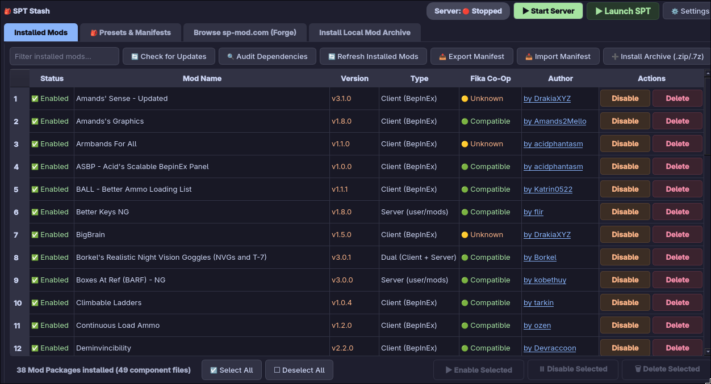
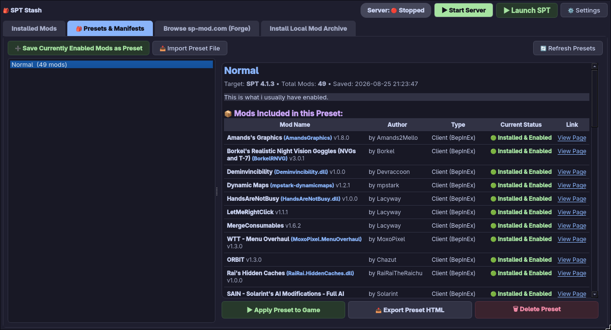
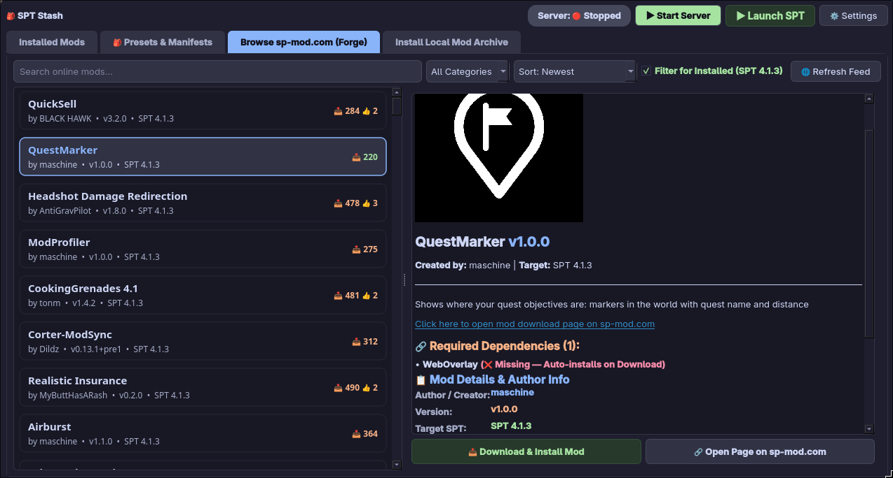
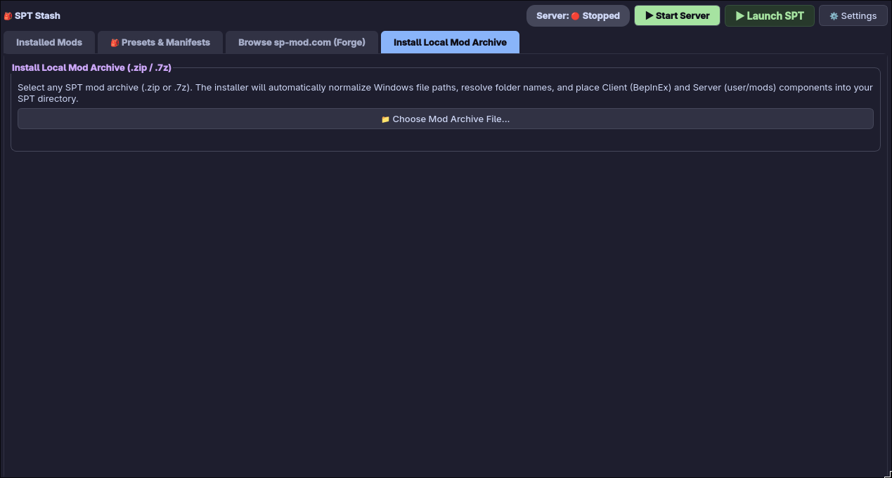
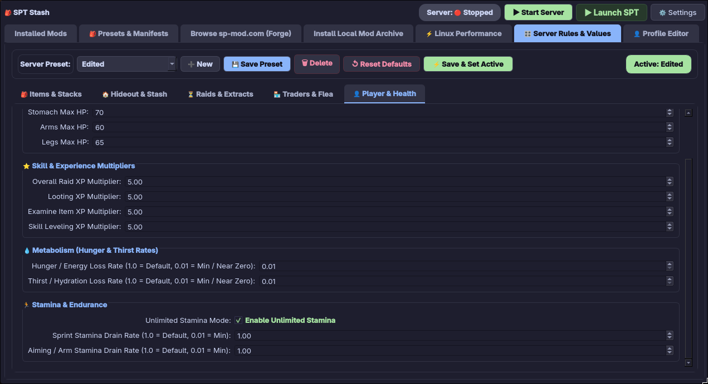
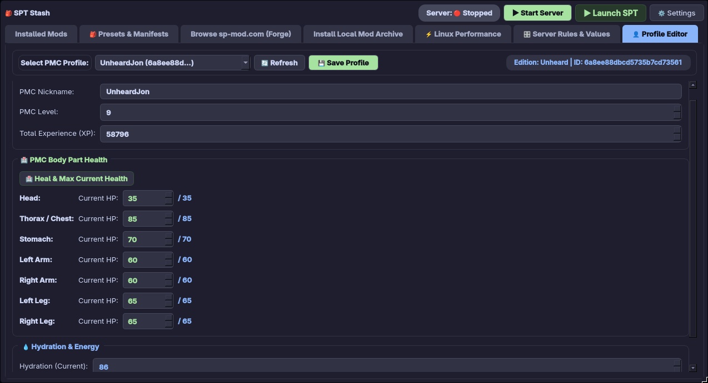
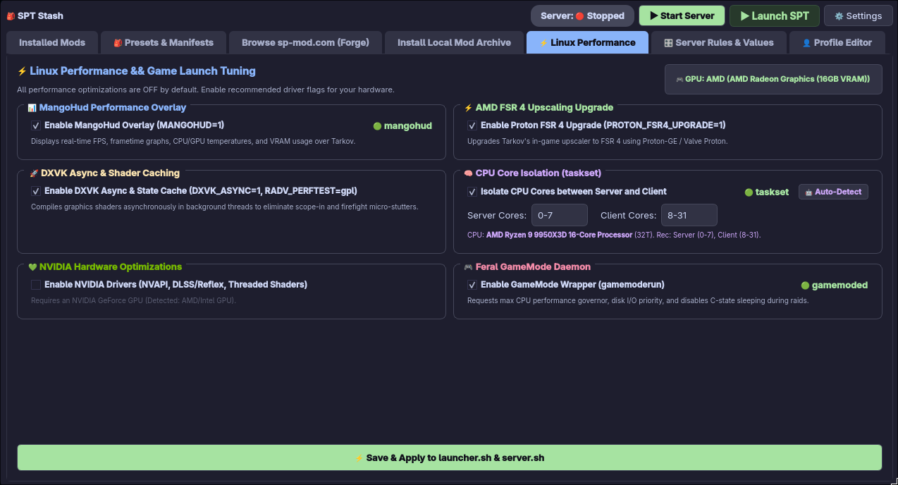

# 🎒 SPT Stash

> **Native Linux Mod Manager & Management Suite for Single-Player Tarkov (SPT)**

[](https://github.com/j-cardell/spt-stash/actions/workflows/ci.yml)
[](https://github.com/j-cardell/spt-stash/actions/workflows/appimage.yml)
[](LICENSE)

**SPT Stash** is a native Linux desktop application built specifically for Single-Player Tarkov (SPT) on Linux and Steam Deck (SteamOS). It provides **zero-copy symlink staging**, **Server Value Modifier (SVM) rules management**, **PMC profile & health editing**, **Linux hardware & game launch performance tuning**, and **1-click sp-mod.com Forge catalog browsing**.

---

## ✨ Core Features

- **⚡ Zero-Copy Symlink Staging**: Enable, disable, or swap client (`BepInEx/plugins`) and server (`user/mods`) mods in milliseconds with zero storage duplication.
- **🎛️ Server Rules & Values (SVM)**: Full GUI for Server Value Modifier settings including item stack limits, metabolism rates (hunger/thirst), stamina drain, raid duration, trader restocks, and raid experience multipliers (`CharXP`). *(Requires [SVM](https://sp-mod.com/mod/236/server-value-modifier-svm)).*
- **👤 PMC Profile Editor**: Direct profile manager to edit character level, total XP, nickname, hydration, energy, and current body part health with 1-click full healing.
- **⚡ Linux Performance & Tuning Suite**: Dedicated tab for configuring **MangoHud overlays**, **AMD FSR 4 upscaling**, **DXVK Async shader compilation**, **Feral GameMode**, **NVIDIA NVAPI optimizations**, and **CPU core isolation (`taskset`)**.
- **🌐 Live Mod Catalog Browser**: Search, filter, and download mods directly from [sp-mod.com (The Forge)](https://sp-mod.com) with automatic dependency detection and `.meta.json` sidecar stamping.
- **🎒 Presets & Loadout Manifests**: Save, load, and export loadout presets as self-contained interactive HTML manifests.
- **📦 Multi-File Mod Consolidation**: Bundles client + server files (e.g. `UI Fixes`, `SAIN`, `Fika`) into clean single-row packages.
- **🟢 Fika Co-Op Compatibility Integration**: Real-time compatibility tracking and badges for co-op multiplayer setups.
- **🔗 Direct Author Profiles**: Click any mod author's name to open their official user profile page on `sp-mod.com`.
- **🎮 Server & Launcher Execution**: Direct process control for `server.sh` and `launcher.sh` with live `pgrep` status monitoring.

---

## 🖼️ Application Showcase

### 1. Installed Mods Overview
Manage client (`BepInEx/plugins`) and server (`user/mods`) mods with zero-copy symlink staging, interactive column sorting, Fika Co-Op compatibility badges, and direct clickable author profile links (`https://sp-mod.com/user/<id>/<author>`).



---

### 2. Presets & Manifest Manager
Create, save, and manage loadout presets with live state auto-syncing. Export interactive, self-contained HTML manifests to share your raid loadouts with friends.



---

### 3. Live Mod Catalog (sp-mod.com Forge)
Browse, search, and 1-click install mods directly from **sp-mod.com (The Forge)** with dependency auto-detection and metadata sidecar stamping.



---

### 4. Local Archive Installer
Drag-and-drop or select any local `.zip` or `.7z` mod archive. Automatically normalizes Windows path separators and places Client/Server components into your staging environment.



---

### 5. Server Rules & Values Manager (SVM Integration)
Customize server rules and global game values without manually editing JSON files. Toggle unlimited stamina, adjust hunger and thirst depletion rates, change raid duration, modify trader restocks and markup, set custom item stack limits, and scale end-of-raid experience multipliers (`CharXP`). *(Requires [SVM](https://sp-mod.com/mod/236/server-value-modifier-svm)).*



---

### 6. PMC Profile Editor
Inspect and update PMC progression and character state. Edit nickname, character level, total experience (XP), hydration, energy, and current body part health (Head, Chest, Stomach, Arms, Legs) with 1-click full healing.



---

### 7. Linux Performance & Game Launch Tuning
Enable recommended Linux performance driver flags for your hardware. Toggle **MangoHud overlays**, **AMD FSR 4 upscaling**, **DXVK Async shader compilation**, **Feral GameMode**, **NVIDIA NVAPI/threaded optimizations**, and **CPU core isolation (`taskset`)** between server and client processes with 1-click script auto-syncing.



---

## ⚙️ Settings & Path Configuration Guide

Click **⚙️ Settings** at the top right of **SPT Stash** to configure your installation paths:

| Setting | Plain-English Description | Example Path |
| :--- | :--- | :--- |
| **SPT Installation Folder** | Select the root folder where your Single-Player Tarkov installation lives. Must contain `server.sh`, `launcher.sh`, `BepInEx`, and `SPT_Runtime`. <br>⚠️ *Do **NOT** select your Wine/Proton Tarkov prefix directory.* | `~/Games/SPT` |
| **Mod Staging Stash Directory** | Local directory where **SPT Stash** downloads and extracts mod files. Mods stay safely stored here and are symlinked into your game when enabled. | `~/.local/share/spt-mod-manager/staged` |
| **Start Server Script Path** | Path to `server.sh` (or `SPT.Server.exe`) used to launch the local SPT server. | `~/Games/SPT/server.sh` |
| **Launch SPT Script Path** | Path to `launcher.sh` (or `SPT.Launcher.exe`) used to start the launcher and game. | `~/Games/SPT/launcher.sh` |

> 💡 **Missing Script Alert**: If `server.sh` or `launcher.sh` are not found when launching, **SPT Stash** displays an alert dialog with a direct **`⚙️ Open Settings`** button to update your paths.

### 📁 File Locations & System Data Storage

| Component | System Location | Purpose / Description |
| :--- | :--- | :--- |
| **Config File** | `~/.config/spt-mod-manager/config.json` | Stores configured paths (`spt_path`, `staged_dir`, `server_script`, `launcher_script`). |
| **Presets Directory** | `~/.config/spt-mod-manager/presets/` | Stores saved raid loadout preset `.json` files. |
| **Mod Staging Stash** | `~/.local/share/spt-mod-manager/staged/` | Directory where downloaded mod archives are unzipped before symlinking. |
| **Catalog Cache** | `~/.cache/spt-mod-manager/catalog.json` | Offline cache of sp-mod.com Forge mod catalog metadata. |

---

## 🚀 Installation & Desktop Shortcut Setup

### Option 1: Standalone AppImage (Recommended)
Download the latest pre-compiled `SPT_Stash-x86_64.AppImage` from [GitHub Releases](https://github.com/j-cardell/spt-stash/releases):

```bash
chmod +x SPT_Stash-x86_64.AppImage
./SPT_Stash-x86_64.AppImage
```

### Option 2: Pre-compiled Standalone Linux Binary (`spt-stash`)
Download the standalone executable `spt-stash` binary from [GitHub Releases](https://github.com/j-cardell/spt-stash/releases) (no AppImage wrapper or Python environment required):

```bash
chmod +x spt-stash
./spt-stash
```

### Option 3: Run from Source
Requires Python 3.10+ and PySide6:

```bash
# Install PySide6
pip install PySide6

# Run SPT Stash
python3 spt_mod_manager.py
```

### 📌 1-Click Desktop & Application Launcher Shortcut
To add **SPT Stash** to your system application menu and desktop:

```bash
python3 install_desktop_shortcut.py
```

---

## 🧪 Testing & Quality Assurance

Run the automated AST linter and unit test suite:

```bash
python3 run_tests.py
```

---

## 📄 License
Distributed under the MIT License. See `LICENSE` for more information.
